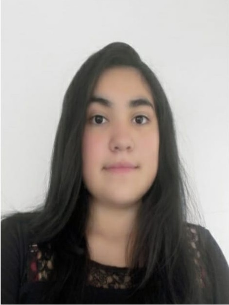

<!DOCTYPE html>
<html lang="en">
<head>
<title>Hoja de vida</title>
<h1>Hoja de Vida </h1>
</head>
<body>
    
    <h2>Nicoll Niyireth Lopez Lozano</h2>
    <h2>Estudiante de ingenieria de sistemas</h2>

<h3 style="font-family:Verdana, Geneva, Tahoma, sans-serif;">Mi nombre es Nicoll Lopez soy estudiante de ingenieria de sistemas sexto semestre, los primeros semestres de mi carrrera no me gusto mucho a medida que iba avanzando me apasione mucho mas, debido a que los temas que investigaba eran mas emocionantes,
    entendi que no es solo una carrera de escritorio sino que va mas alla de eso, de mi carrera hay dos temas que me interesaron mucho los cuales son ciber seguridad y desarrollo de aplicaciones, en un trabajo para una materia tuve que investigar muchas cosas 
    entre estas el tema de ciber seguridad y me gusto muchisimo esto por que inicialmente se creo el navegador TOR para hacer que el usuartio tuviera mas privacidad, sin embargo hoy en dia este navegador es usado por los hackers y gobiernos para diferentes motivos; en 
    el tema del desarrollo de aplicaciones me gusta mucho por que yo puedo diseñar varias cosas que desee.
</h3 >
<h3 style="color:rgb(0, 217, 255)">Hobits</h3>
<ol type="a" ><li>Ver Series y Peliculas</li><li>Dibujar</li><li>Jugar Tennis</li><li>Escuhar musica</li><li>Leer</li><li>Ir de campamento</li><li>Ver Animes</li></ol>
<h3 style="color:#05bcf3">Conocimientos</h3>
<ol type="a" ><li>PYTHON</li><li>HTML</li><li>CSS</li><li>JAVASCRIPT</li><li>REDES</li><li>CISCO PACKET TRACER</li><li>C#</li></ol>

Contacto
<ol type="a" ><li>Correo:nlopezl36845@universidadean.edu.co</li>
</body >
</html  >
